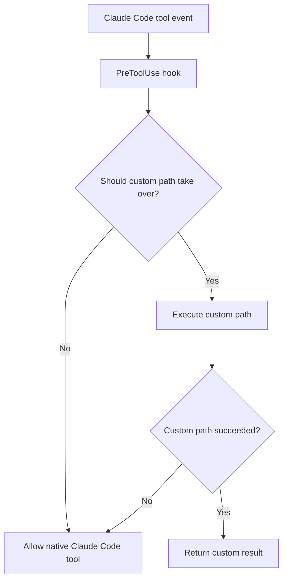

# Claude Code Web Hooks

Standalone hook-tool project for **Claude Code** that augments two built-in tool paths at the client runtime layer:
- `WebSearch`
- `WebFetch`

This project is intentionally designed for **Claude Code only**. It relies on Claude Code hook events such as `PreToolUse`, so it should be treated as a Claude Code runtime integration rather than a general gateway/server feature.

### Why this tool exists
This project solves a practical gap that appears when Claude Code is used with **custom endpoints** or third-party model paths.

In those environments, Claude Code may still emit native `WebSearch` or `WebFetch` intent, but the upstream path may not support the same server-side search/process behavior that Claude’s native stack expects.

As a result, users can hit problems such as:
- native `WebSearch` not working correctly through a custom endpoint
- provider/model paths that cannot complete the expected Claude Code search process server-side
- `WebFetch` returning template-heavy or CSR-heavy HTML that is technically reachable but not actually usable as readable content

### What capability this adds
This tool increases the practical usefulness of Claude Code in two ways:

#### WebSearch capability uplift
- adds a search substitution path when server-side/native search processing is not available through the custom endpoint
- preserves native Claude Code behavior when the custom path should not take over
- avoids dead-end failures by falling back instead of trapping the user in a broken custom search path

#### WebFetch capability uplift
- adds a pre-check layer before fetch execution
- distinguishes fetch-readable pages from template-heavy or browser-render-required pages
- escalates to scraper fallback only when needed
- preserves native fetch when the simpler path is already good enough

---

## What this project does

### WebSearch hook
- Supports multiple search providers
- Current built-in providers:
  - WebSearchAPI.ai
  - Tavily Search
- Falls through to native Claude Code WebSearch when custom execution should not take over
- Supports API key pools, file-based keys, and automatic next-key fallback
- Supports provider policy modes such as `single`, `fallback`, and `parallel`

### WebFetch hook
- Probes the initial HTML first
- Allows native WebFetch for fetch-readable pages
- Detects template-heavy / portal-heavy / browser-render-required pages
- Uses WebSearchAPI scraper fallback only when needed
- Falls through to native WebFetch when custom execution is unavailable or unsuccessful

### Current provider targeting
Current implementation status:
- **WebSearch** supports:
  - WebSearchAPI.ai
  - Tavily Search
- **WebFetch** currently uses:
  - WebSearchAPI.ai scraper fallback

Planned direction:
- the project should remain open to supporting other search APIs in the future
- if a better search provider is identified later, the provider layer can be extended without changing the core Claude Code hook model
- in other words, the project is moving from **provider-specific implementation** toward **provider-agnostic architecture**

### Current provider plan snapshot
The current planning context for WebSearchAPI.ai is:

| Plan | Price | Search Credits | Notes |
|------|------:|---------------:|-------|
| Free | $0/mo | 2,000/mo | Basic search capabilities |
| Pro | $189/mo | 50,000/mo | More search power for growing usage |
| Expert | $1250/mo | 500,000/mo | Higher-scale usage, custom rate limits, volume discounts, SLAs/MSAs |

Common capability notes from the current plan snapshot:
- content extraction
- localization (country and language)
- higher tiers can include rate-limit and enterprise-style options

This table is a **current planning note**, not a permanent contract. The implementation may change later if pricing, reliability, or capability trade-offs make another provider a better fit.

---

## Failure policy

This project uses a **fully permissive fallback** policy.

### Core rule
If the custom path cannot complete successfully, it should not trap the user when the native Claude Code tool can still continue.

### WebSearch
Current behavior:
- success → `class=search-substitution -> <provider>`
- no provider keys → allow native WebSearch
- auth failure → allow native WebSearch
- credit / quota failure → allow native WebSearch
- transient provider failure → allow native WebSearch
- unknown provider failure → allow native WebSearch

Current provider policy modes:
- `single`
- `fallback`
- `parallel` (**current default**)

Current default order:
- `tavily`
- `websearchapi`

### WebFetch
Current behavior:
- fetch-readable page → allow native WebFetch
- unsupported/probe-unusable → allow native WebFetch
- no key for scraper path → allow native WebFetch
- scraper fallback success → use scraper result
- scraper fallback failure (including exhausted key pool) → allow native WebFetch

### Shared helper
Failure classification is shared by both hooks:
- `hooks/shared/failure-policy.cjs`

Current classes:
- `auth-failed`
- `credit-or-quota-failed`
- `transient-provider-failed`
- `unknown`

In the current version, **all four classes allow native fallback**.

---

## GitHub flow diagram



---

## Repository layout

```text
claude-code-web-hooks/
  README.md
  LICENSE
  .gitignore
  design.md
  changelog.md
  TODO.md
  settings.example.json
  apikey.example.json
  apikeys.example.txt
  install.sh
  uninstall.sh
  verify.sh
  fixtures/
    article-readable.html
    template-heavy.html
    browser-shell.html
  hooks/
    websearch-custom.cjs
    webfetch-scraper.cjs
    shared/
      failure-policy.cjs
      search-provider-contract.cjs
      search-provider-policy.cjs
      search-providers/
        websearchapi.cjs
        tavily.cjs
```

---

## How to install

### Option 1 — automatic install

```bash
git clone <your-repo-url>
cd claude-code-web-hooks
./install.sh
```

What `install.sh` does:
- copies hook files into `~/.claude/hooks/`
- copies the shared helpers into `~/.claude/hooks/shared/`
- copies the provider adapters into `~/.claude/hooks/shared/search-providers/`
- backs up `~/.claude/settings.json` before editing
- merges the required `PreToolUse -> WebSearch`
- merges the required `PreToolUse -> WebFetch`
- preserves unrelated Claude Code settings

After install:
- open `/hooks` in Claude Code to reload configuration
- or restart the Claude Code session

### Option 2 — manual install

1. Copy the hook files into `~/.claude/hooks/`
2. Copy the shared helpers into `~/.claude/hooks/shared/`
3. Copy the provider adapters into `~/.claude/hooks/shared/search-providers/`
4. Merge the `hooks` block from `settings.example.json` into `~/.claude/settings.json`
5. Add the env variables you want to use

---

## How to uninstall

```bash
./uninstall.sh
```

What `uninstall.sh` does:
- removes the installed hook files from `~/.claude/hooks/`
- removes the installed shared helper from `~/.claude/hooks/shared/`
- backs up `~/.claude/settings.json` before editing
- removes only the `PreToolUse -> WebSearch` and `PreToolUse -> WebFetch` entries installed by this project
- leaves unrelated Claude Code settings intact

---

## How to use

### 1) Add hooks to Claude Code
Use `settings.example.json` as the base example.

The hook commands should point to the real installed paths under `~/.claude/hooks/` after running `install.sh`.

### 2) Configure API keys
The project currently uses **separate provider keys**:
- `WEBSEARCHAPI_API_KEY` for WebSearchAPI.ai
- `TAVILY_API_KEY` for Tavily

`WEBSEARCHAPI_API_KEY` supports:

#### A. Single inline key
```json
"WEBSEARCHAPI_API_KEY": "your_api_key"
```

#### B. Inline pool with `|`
```json
"WEBSEARCHAPI_API_KEY": "key1|key2|key3"
```

#### C. JSON file path
```json
"WEBSEARCHAPI_API_KEY": "/absolute/path/to/apikey.json"
```

Example file:
```json
["apikey1", "apikey2"]
```

#### D. Newline-separated text file path
```json
"WEBSEARCHAPI_API_KEY": "/absolute/path/to/apikeys.txt"
```

Example file:
```text
# One API key per line
# Lines starting with # are ignored
apikey1
apikey2
```

Notes:
- file mode first tries JSON-array parsing
- if JSON parsing fails, it falls back to newline-separated parsing
- blank lines are ignored
- lines starting with `#` are ignored
- inline pools and file pools are shuffled per request
- if one key fails, the next key is tried automatically

### 3) Optional env variables
Recommended example for the **current implementation**:

> Important:
> - Tavily does **not** use `WEBSEARCHAPI_API_KEY`
> - use `TAVILY_API_KEY` for Tavily authentication
> - current default behavior in code is already:
>   - `CLAUDE_WEB_HOOKS_SEARCH_MODE=parallel`
>   - `CLAUDE_WEB_HOOKS_SEARCH_PROVIDERS=tavily,websearchapi`
> - you can still set them explicitly if you want the config to be self-documenting

```json
{
  "env": {
    "CLAUDE_WEB_HOOKS_SEARCH_MODE": "parallel",
    "CLAUDE_WEB_HOOKS_SEARCH_PROVIDERS": "tavily,websearchapi",
    "WEBSEARCHAPI_API_KEY": "/absolute/path/to/apikeys.txt",
    "TAVILY_API_KEY": "/absolute/path/to/tavily-keys.txt",
    "WEBSEARCHAPI_MAX_RESULTS": "10",
    "WEBSEARCHAPI_INCLUDE_CONTENT": "1",
    "WEBSEARCHAPI_COUNTRY": "us",
    "WEBSEARCHAPI_LANGUAGE": "en",
    "TAVILY_SEARCH_DEPTH": "advanced",
    "TAVILY_MAX_RESULTS": "10",
    "TAVILY_TOPIC": "general",
    "WEBFETCH_SCRAPER_RETURN_FORMAT": "markdown",
    "WEBFETCH_SCRAPER_ENGINE": "browser",
    "CLAUDE_WEB_HOOKS_WEBSEARCH_TIMEOUT": "55",
    "CLAUDE_WEB_HOOKS_DEBUG": "0"
  }
}
```

What these keys do:
- `CLAUDE_WEB_HOOKS_SEARCH_MODE`: search provider execution mode (`single`, `fallback`, `parallel`)
- `CLAUDE_WEB_HOOKS_SEARCH_PROVIDERS`: provider order for the search policy layer
- `WEBSEARCHAPI_API_KEY`: WebSearchAPI.ai key / key pool / key file path
- `TAVILY_API_KEY`: Tavily key / key pool / key file path
- `TAVILY_SEARCH_DEPTH`, `TAVILY_MAX_RESULTS`, `TAVILY_TOPIC`: Tavily Search tuning
- `WEBFETCH_SCRAPER_*`: WebFetch scraper fallback behavior
- `CLAUDE_WEB_HOOKS_WEBSEARCH_TIMEOUT`: shared default timeout for search providers
- `CLAUDE_WEB_HOOKS_DEBUG`: debug logging for the hook layer

---

## Example Claude Code settings snippet

```json
{
  "hooks": {
    "PreToolUse": [
      {
        "matcher": "WebSearch",
        "hooks": [
          {
            "type": "command",
            "command": "node \"/home/your-user/.claude/hooks/websearch-custom.cjs\"",
            "timeout": 120
          }
        ]
      },
      {
        "matcher": "WebFetch",
        "hooks": [
          {
            "type": "command",
            "command": "node \"/home/your-user/.claude/hooks/webfetch-scraper.cjs\"",
            "timeout": 120
          }
        ]
      }
    ]
  }
}
```

See also:
- `settings.example.json`

---

## Verify before release or update

Run:

```bash
./verify.sh
```

What it checks:
- hook syntax
- install/uninstall script syntax
- example settings shape
- fixture-based WebFetch classification
- shared failure policy behavior

---

## Release notes

This project is currently suitable for:
- private repository use
- internal distribution
- controlled public release after reviewing repository metadata and installation instructions

---

## Related files
- `design.md` — design direction and contracts
- `changelog.md` — history
- `TODO.md` — release and follow-up work
- `settings.example.json` — Claude Code settings example
