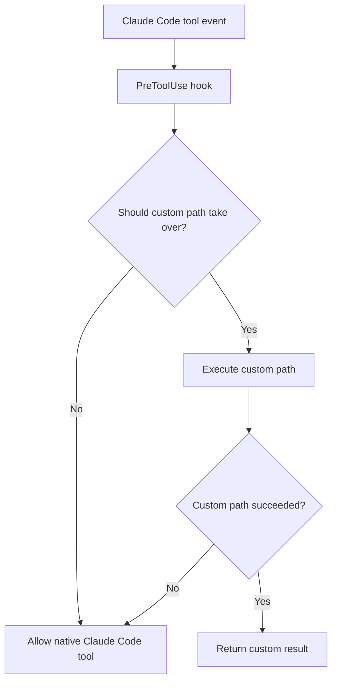

# Claude Code Web Hooks

Standalone hook-tool project for **Claude Code** with compatibility wrappers for **GitHub Copilot on VS Code** and **GitHub Copilot CLI** that augments two built-in tool paths at the client runtime layer:
- `WebSearch`
- `WebFetch`

The shared core is designed around the Claude-style hook flow, then adapted through runtime-specific wrappers/config for Copilot targets. It should still be treated as a client-side runtime integration rather than a general gateway/server feature.

### Why this tool exists
This project solves a practical gap that appears when Claude Code is used with **custom endpoints** or third-party model paths.

In those environments, Claude Code may still emit native `WebSearch` or `WebFetch` intent, but the upstream path may not support the same server-side search/process behavior that Claude’s native stack expects.

As a result, users can hit problems such as:
- native `WebSearch` not working correctly through a custom endpoint
- provider/model paths that cannot complete the expected Claude Code search process server-side
- `WebFetch` returning template-heavy or CSR-heavy HTML that is technically reachable but not actually usable as readable content

### What capability this adds
This tool increases the practical usefulness of Claude Code in two ways:

#### WebSearch capability uplift
- adds a search substitution path when server-side/native search processing is not available through the custom endpoint
- preserves native Claude Code behavior when the custom path should not take over
- avoids dead-end failures by falling back instead of trapping the user in a broken custom search path

#### WebFetch capability uplift
- adds a pre-check layer before fetch execution
- distinguishes fetch-readable pages from template-heavy or browser-render-required pages
- escalates to scraper fallback only when needed
- preserves native fetch when the simpler path is already good enough

---

## What this project does

### WebSearch hook
- Supports multiple search providers
- Current built-in providers:
  - WebSearchAPI.ai
  - Tavily Search
  - Exa Search
- Falls through to native Claude Code WebSearch when custom execution should not take over
- Supports API key pools, file-based keys, and automatic next-key fallback
- Supports provider policy modes such as `fallback` and `parallel`

### WebFetch hook
- Probes the initial HTML first
- Allows native WebFetch for fetch-readable pages
- Detects template-heavy / portal-heavy / browser-render-required pages
- Uses one selectable extraction backend per request when extraction is needed
- Supports ordered fallback across:
  - WebSearchAPI.ai Scrape
  - Tavily Extract
  - Exa Contents
- Falls through to native WebFetch when custom execution is unavailable or unsuccessful

### Current provider targeting
Current implementation status:
- **WebSearch** supports:
  - WebSearchAPI.ai
  - Tavily Search
  - Exa Search
- **WebFetch** supports:
  - WebSearchAPI.ai Scrape
  - Tavily Extract
  - Exa Contents

Current direction:
- the project keeps the same Claude Code hook model while expanding both search and extraction provider support
- provider choice can evolve without changing the core Claude Code hook entrypoints
- in other words, the project has moved from **provider-specific implementation** toward **provider-agnostic architecture**

### Current provider plan snapshot

#### WebSearchAPI.ai
The current planning context for WebSearchAPI.ai is:

| Plan | Price | Search Credits | Notes |
|------|------:|---------------:|-------|
| Free | $0/mo | 2,000/mo | Basic search capabilities |
| Pro | $189/mo | 50,000/mo | More search power for growing usage |
| Expert | $1250/mo | 500,000/mo | Higher-scale usage, custom rate limits, volume discounts, SLAs/MSAs |

Common capability notes from the current plan snapshot:
- content extraction
- localization (country and language)
- higher tiers can include rate-limit and enterprise-style options

#### Tavily
The current pricing context for Tavily is:

| Plan | Price | API Credits | Notes |
|------|------:|------------:|-------|
| Researcher | $0/mo | 1,000/mo | Free tier for new creators, no credit card required |
| Pay As You Go | $0.008/credit | usage-based | Flexible usage, cancel anytime |
| Project | $30/mo | 4,000/mo | Higher rate limits for enthusiasts |
| Enterprise | Custom | Custom | Custom rate limits, enterprise support, security/privacy |

Practical usage notes from the current Tavily pricing page:
- credits are used across Tavily capabilities such as search, extract, and crawl
- monthly included credits reset on the first day of the month
- if credits run out, requests stop until credits reset or the plan changes
- the API key is obtained from the Tavily dashboard after sign-up
- the pricing page also mentions a student offering and email support on non-enterprise plans

#### Exa
The current pricing context for Exa is:

| Product / Plan Surface | Price | Usage Basis | Notes |
|------------------------|------:|------------:|-------|
| Free usage | $0/mo | up to 1,000 requests/month | Entry-level free API usage |
| Search | $7 / 1k requests | 1–10 results | +$1 / 1k additional results beyond 10 |
| Agentic Search | $12 / 1k requests | request-based | deeper structured search mode |
| Agentic Search + reasoning | +$3 / 1k requests | add-on | applied on top of Agentic Search reasoning usage |
| Contents | $1 / 1k pages per content type | page-based | useful for full-page retrieval |
| Answer | $5 / 1k answers | answer-based | direct answer generation with citations |
| Enterprise | Custom | custom | custom QPS, rate limits, support, pricing |

Practical usage notes from current Exa docs/pricing:
- Search is positioned for agent web-search tool calls
- Search latency is described around 100–1200 ms depending on search mode
- Agentic Search is slower (roughly 4–30 s) but intended for deeper structured workflows
- Contents is presented as a token-efficient full-page retrieval path
- Enterprise mentions custom QPS, custom rate limits, and volume discounts
- Startup and education grants are mentioned with free credit programs

These tables are **current planning notes**, not permanent contracts. The implementation may change later if pricing, reliability, or capability trade-offs make another provider a better fit.

### Practical provider comparison for this repository

| Provider | Best fit in this repo | Search | Extract / Scrape | Fallback role | Cost profile | Notes |
|---------|------------------------|--------|------------------|---------------|--------------|-------|
| WebSearchAPI.ai | balanced default for current WebSearch + one current WebFetch extraction backend | Yes | Yes | interchangeable search/extraction backend | predictable monthly plans | one provider can cover both search and extraction paths |
| Tavily | strong search provider for Claude Code custom-endpoint workflows | Yes | Yes (`Extract`) | interchangeable search/extraction backend | lower entry cost and clear PAYG path | now supported in both search and WebFetch extraction flow |
| Exa | current additional provider with stronger retrieval-oriented content features | Yes | Yes (`Contents`) | interchangeable search/extraction backend | request-based pricing; deeper modes cost more | supported in both search and WebFetch extraction flow |

### Comparison notes
- **WebSearchAPI.ai** is currently the broadest fit for the project because the current implementation already uses it for both WebSearch substitution and WebFetch scraper fallback.
- **Tavily** is currently the most practical second search provider because its Search and Extract APIs are clearly separated and its pricing/entry path are straightforward.
- **Exa** is now an active search-layer provider in this repo and remains strategically interesting because it adds another provider-backed search path without changing the existing abstraction model.

### Exa.ai implementation notes

Exa is now integrated into the **WebSearch provider layer** of this project.

#### Relevant Exa capabilities
- `Search` endpoint for web search results and their contents
- `Agentic Search` / deeper search modes for structured/deeper search workflows
- `Contents` endpoint for page-content retrieval
- `Answer` endpoint for direct answers with citations
- `Research` product for autonomous research tasks

#### What Exa currently means in this repo
- Exa is a **current WebSearch provider**
- Exa participates through the shared search-provider abstraction and policy layer
- Exa Contents is also part of the current WebFetch extraction backend set
- in WebFetch, Exa is one interchangeable extraction backend among the three supported providers

#### Why Exa is still strategically interesting
- it has a search-first API surface that maps naturally to the project’s provider-abstraction direction
- it has dedicated content retrieval pricing (`Contents`) that could matter later if the project expands beyond pure search substitution
- docs show explicit search parameters like result count, domains, country, and content inclusion, which fits the current hook model well

#### Exa pricing snapshot (current planning note)
- Free usage: up to **1,000 requests/month**
- Search: **$7 / 1k requests** for **1–10 results**, **+$1 / 1k** additional results beyond 10
- Agentic Search: **$12 / 1k requests**
- Agentic Search with reasoning: **+$3 / 1k requests** on top of that mode
- Contents: **$1 / 1k pages per content type**
- Answer: **$5 / 1k answers**
- Research: priced separately around agent-style operations / page reads / reasoning-token usage

#### Practical Exa notes for this repo
- Exa is already integrated as a **current search-layer provider** and not used as a WebFetch replacement.
- The clean path remains:
  - keep Exa behind the shared search-provider policy
  - keep WebFetch extractor work separate unless there is a deliberate extract-provider expansion phase
- Exa should continue to use the same provider abstraction as Tavily and WebSearchAPI.ai.

---

## Failure policy

This project uses a **fully permissive fallback** policy.

### Core rule
If the custom path cannot complete successfully, it should not trap the user when the native Claude Code tool can still continue.

### WebSearch
Current behavior:
- success in `fallback` mode → return the first successful provider result in effective provider order
- success in `parallel` mode → return **all successful provider results**
- partial failure in `parallel` mode → still return successful provider results and list failed providers
- no provider keys → allow native WebSearch
- auth failure → allow native WebSearch
- credit / quota failure → allow native WebSearch
- transient provider failure → allow native WebSearch
- unknown provider failure → allow native WebSearch

Current provider policy modes:
- `fallback`
- `parallel` (**current default**)

Current default order:
- `tavily`
- `websearchapi`

Provider-selection relationship:
- `CLAUDE_WEB_HOOKS_SEARCH_MODE` controls **how** providers are executed
- `CLAUDE_WEB_HOOKS_SEARCH_PROVIDERS` controls the configured provider order
- `CLAUDE_WEB_HOOKS_SEARCH_PRIMARY`, if set, is treated as a priority override and moved to the front of the provider order
- in `fallback` mode, that means the system starts with `SEARCH_PRIMARY` first, then continues through the remaining ordered providers
- in `parallel` mode, all providers still run, but the success/failure blocks are ordered with the effective provider order

### WebFetch
Current behavior:
- fetch-readable page → allow native WebFetch
- unsupported/probe-unusable → allow native WebFetch
- if extraction is recommended, the hook supports three interchangeable extraction backends:
  - WebSearchAPI.ai Scrape
  - Tavily Extract
  - Exa Contents
- one backend is chosen per request
  - if `CLAUDE_WEB_HOOKS_WEBFETCH_EXTRACT_PRIMARY` is set, it is tried first
  - if `PRIMARY` is not set, the initial backend is chosen randomly from configured providers that have keys available
- if the chosen backend fails, the hook rotates through the remaining configured providers in fallback order
- if all extraction backends fail (including exhausted key pools), allow native WebFetch
- on success, return exactly one extracted content result from the winning backend

### Shared helper
Failure classification is shared by both hooks:
- `hooks/shared/failure-policy.cjs`

Current classes:
- `auth-failed`
- `credit-or-quota-failed`
- `transient-provider-failed`
- `unknown`

In the current version, **all four classes allow native fallback**.

---

## GitHub flow diagram



---

## Repository layout

```text
claude-code-web-hooks/
  README.md
  LICENSE
  .gitignore
  design.md
  changelog.md
  TODO.md
  settings.example.json
  apikey.example.json
  apikeys.example.txt
  install.sh
  uninstall.sh
  verify.sh
  fixtures/
    article-readable.html
    template-heavy.html
    browser-shell.html
  hooks/
    websearch-custom.cjs
    webfetch-scraper.cjs
    shared/
      failure-policy.cjs
      provider-config.cjs
      search-provider-contract.cjs
      search-provider-policy.cjs
      extract-provider-contract.cjs
      extract-provider-policy.cjs
      search-providers/
        websearchapi.cjs
        tavily.cjs
        exa.cjs
      extract-providers/
        websearchapi.cjs
        tavily.cjs
        exa.cjs
```

---

## How to install

### Option 1 — automatic install

Current installer supports multiple targets.

```bash
git clone <your-repo-url>
cd claude-code-web-hooks
./install.sh --target claude-code
```

What `install.sh` currently does for `claude-code`:
- copies hook files into `~/.claude/hooks/`
- copies the shared helpers into `~/.claude/hooks/shared/`
- copies the search provider adapters into `~/.claude/hooks/shared/search-providers/`
- copies the extraction provider adapters into `~/.claude/hooks/shared/extract-providers/`
- backs up `~/.claude/settings.json` before editing
- merges the required `PreToolUse -> WebSearch`
- merges the required `PreToolUse -> WebFetch`
- optionally adds a non-blocking `PreToolUse` pass-through matcher for `mcp__ccs-websearch__WebSearch` only when `--with-ccs-mcp-pass-through` is requested
- optionally adds a matching `PostToolUse` companion matcher for `mcp__ccs-websearch__WebSearch` so the original CCS MCP result and this repo’s companion result can be shown together
- optionally adds a matching `PostToolUseFailure` fallback matcher for `mcp__ccs-websearch__WebSearch` so failed CCS MCP runs can still attach provider-backed fallback context from this repo
- preserves unrelated Claude Code settings and preserves existing user-owned MCC/CCS matcher entries

After install:
- open `/hooks` in Claude Code to reload configuration
- or restart the Claude Code session

### Target-aware install modes
The installer / uninstaller / verifier now support these targets:
- `claude-code`
- `copilot-vscode`
- `copilot-cli`
- `all`

Current direction:
- keep the current Claude Code path working
- add Copilot-on-VS-Code compatibility through runtime-specific wrapper/config placement
- add Copilot CLI compatibility through the same wrappers plus repo-scoped hook config
- allow `all` so every currently supported target can be installed together from one command
- keep the model open to additional targets later, rather than freezing it as a two-target design

Examples:
```bash
./install.sh --target claude-code
./install.sh --target claude-code --with-ccs-mcp-pass-through
./install.sh --target copilot-vscode
./install.sh --target copilot-cli
./install.sh --target all

./uninstall.sh --target claude-code
./uninstall.sh --target copilot-vscode
./uninstall.sh --target copilot-cli
./uninstall.sh --target all

./verify.sh --target claude-code
./verify.sh --target copilot-vscode
./verify.sh --target copilot-cli
./verify.sh --target all
```

### Option 2 — manual install

#### Claude Code
1. Copy the hook files into `~/.claude/hooks/`
2. Copy the shared helpers into `~/.claude/hooks/shared/`
3. Copy the search provider adapters into `~/.claude/hooks/shared/search-providers/`
4. Copy the extraction provider adapters into `~/.claude/hooks/shared/extract-providers/`
5. Merge the native `WebSearch` and `WebFetch` `hooks` block from `settings.example.json` into `~/.claude/settings.json`
6. Add the env variables you want to use (`WEBSEARCHAPI_API_KEY`, `TAVILY_API_KEY`, and/or `EXA_API_KEY`)
7. Only add the optional `ccsMcpHooksExample` block if you explicitly want the CCS MCP coexistence hook set for `mcp__ccs-websearch__WebSearch`
   - `PreToolUse` = allow-only pass-through
   - `PostToolUse` = preserve the CCS MCP output and append the repo companion result
   - `PostToolUseFailure` = preserve the CCS MCP error as checked context and append provider-backed fallback context from this repo

#### Copilot on VS Code
1. Copy the wrapper hooks:
   - `hooks/copilot-websearch.cjs`
   - `hooks/copilot-webfetch.cjs`
2. Keep the shared core logic available in the same repo/workspace
3. Add a user hook config file, for example:
   - user: `~/.copilot/hooks/claude-code-web-hooks.json`
4. The installed user hook config points at the installed wrapper scripts in `~/.claude/hooks/`
5. Set `COPILOT_WEBSEARCH_TOOL_NAMES` and `COPILOT_WEBFETCH_TOOL_NAMES` to the tool names you want the wrappers to intercept

#### Copilot CLI
1. Keep the wrapper hooks available:
   - `hooks/copilot-websearch.cjs`
   - `hooks/copilot-webfetch.cjs`
2. Use the repo-scoped hook config under `.github/hooks/`
3. Current checked official behavior:
   - Copilot CLI loads hooks from the current working directory
   - repo hook config lives under `.github/hooks/`
   - hook config uses `version: 1` plus lower-camel event keys such as `preToolUse`
4. The repo hook config points at the installed wrapper scripts in `~/.claude/hooks/`
5. Set `COPILOT_CLI_WEBSEARCH_TOOL_NAMES` and `COPILOT_CLI_WEBFETCH_TOOL_NAMES` to the Copilot CLI tool names you want the wrappers to intercept
6. The wrappers adapt Copilot CLI `toolName` / `toolArgs` input into the shared Claude-style core and map the child result back into CLI permission output

#### All
Install the Claude Code path, Copilot-on-VS-Code path, and Copilot CLI path together.

---

## How to uninstall

```bash
./uninstall.sh --target claude-code
```

What `uninstall.sh` now does depends on target:
- `claude-code`
  - removes installed hooks from `~/.claude/hooks/`
  - removes installed shared helpers / provider adapters from `~/.claude/hooks/shared/`
  - backs up and updates `~/.claude/settings.json`
- `copilot-vscode`
  - removes Copilot compatibility wrappers from `~/.claude/hooks/`
  - removes the user-level Copilot hook config from `~/.copilot/hooks/`
  - leaves the repo-scoped Copilot CLI hook file in place
- `copilot-cli`
  - removes Copilot compatibility wrappers from `~/.claude/hooks/`
  - leaves the repo-scoped `.github/hooks/` hook file in place
- `all`
  - removes local installed targets together while keeping the repo-scoped example/runtime hook file

---

## How to use

### 1) Add hooks to Claude Code
Use `settings.example.json` as the base example.

The hook commands should point to the real installed paths under `~/.claude/hooks/` after running `install.sh`.

For Copilot targets, use the runtime-specific wrapper scripts instead:
- `hooks/copilot-websearch.cjs`
- `hooks/copilot-webfetch.cjs`

These wrappers exist because Copilot runtimes currently differ from Claude Code in two important ways:
- VS Code reads Claude-style hook config but ignores matcher values and may use different tool names / input shapes
- Copilot CLI uses `toolName` and stringified `toolArgs` in `preToolUse`, and expects CLI-style permission output
- both Copilot targets are normalized through the same wrapper pair before reaching the shared core

### 2) Optional CCS MCP coexistence

If you also use the CCS MCP server and want this repo to explicitly recognize the CCS MCP search tool without blocking it, add the optional `ccsMcpHooksExample` block from `settings.example.json`.

Coexistence contract:
- native `WebSearch` is still the only substitution path owned by this repo
- `mcp__ccs-websearch__WebSearch` remains owned by CCS for the actual MCP search execution
- the optional `PreToolUse` MCP matcher is allow-only pass-through
- the optional `PostToolUse` MCP matcher builds a second provider-backed companion result from this repo for successful MCP runs
- the `PostToolUse` hook replaces the visible MCP tool output with a combined payload that preserves the original CCS MCP result first and appends the `claude-code-web-hooks` companion result second
- the optional `PostToolUseFailure` matcher builds provider-backed fallback context from this repo for failed MCP runs
- on failed MCP runs, the repo currently adds fallback material through `additionalContext` rather than pretending it can replace failed MCP output, because the current Claude Code docs only document `updatedMCPToolOutput` for successful `PostToolUse`
- this means one successful MCP run can surface both outputs together without blocking CCS execution first, while failed MCP runs can still attach repo fallback context

### 3) Configure API keys
The project currently uses **separate provider keys**:
- `WEBSEARCHAPI_API_KEY` for WebSearchAPI.ai Search + WebSearchAPI.ai Scrape
- `TAVILY_API_KEY` for Tavily Search + Tavily Extract
- `EXA_API_KEY` for Exa Search + Exa Contents

`WEBSEARCHAPI_API_KEY` supports:

#### A. Single inline key
```json
"WEBSEARCHAPI_API_KEY": "your_api_key"
```

#### B. Inline pool with `|`
```json
"WEBSEARCHAPI_API_KEY": "key1|key2|key3"
```

#### C. JSON file path
```json
"WEBSEARCHAPI_API_KEY": "/absolute/path/to/apikey.json"
```

Example file:
```json
["apikey1", "apikey2"]
```

#### D. Newline-separated text file path
```json
"WEBSEARCHAPI_API_KEY": "/absolute/path/to/apikeys.txt"
```

Example file:
```text
# One API key per line
# Lines starting with # are ignored
apikey1
apikey2
```

Notes:
- file mode first tries JSON-array parsing
- if JSON parsing fails, it falls back to newline-separated parsing
- blank lines are ignored
- lines starting with `#` are ignored
- inline pools and file pools are shuffled per request
- if one key fails, the next key is tried automatically

`TAVILY_API_KEY` and `EXA_API_KEY` follow the same input rules:
- single inline key
- inline pool using `|`
- JSON array file path
- newline-separated text file path

### 3) Optional env variables
Recommended example for the **current implementation**:

> Important:
> - WebFetch supports three interchangeable extraction backends:
>   - `websearchapi`
>   - `tavily`
>   - `exa`
> - if `CLAUDE_WEB_HOOKS_WEBFETCH_EXTRACT_PRIMARY` is set, it is tried first
> - if `PRIMARY` is not set, the first extraction backend is chosen randomly from providers that have keys available
> - fallback then continues through the remaining available providers
> - current default search behavior in code is still:
>   - `CLAUDE_WEB_HOOKS_SEARCH_MODE=parallel`
>   - `CLAUDE_WEB_HOOKS_SEARCH_PROVIDERS=tavily,websearchapi`

```json
{
  "env": {
    "CLAUDE_WEB_HOOKS_SEARCH_MODE": "parallel",
    "CLAUDE_WEB_HOOKS_SEARCH_PROVIDERS": "tavily,websearchapi",
    "WEBSEARCHAPI_API_KEY": "/absolute/path/to/apikeys.txt",
    "TAVILY_API_KEY": "/absolute/path/to/tavily-keys.txt",
    "EXA_API_KEY": "/absolute/path/to/exa-keys.txt",
    "WEBSEARCHAPI_MAX_RESULTS": "10",
    "WEBSEARCHAPI_INCLUDE_CONTENT": "1",
    "WEBSEARCHAPI_COUNTRY": "us",
    "WEBSEARCHAPI_LANGUAGE": "en",
    "TAVILY_SEARCH_DEPTH": "advanced",
    "TAVILY_MAX_RESULTS": "10",
    "TAVILY_TOPIC": "general",
    "EXA_SEARCH_TYPE": "auto",
    "EXA_MAX_RESULTS": "10",
    "EXA_CATEGORY": "news",
    "CLAUDE_WEB_HOOKS_WEBFETCH_EXTRACT_MODE": "fallback",
    "CLAUDE_WEB_HOOKS_WEBFETCH_EXTRACT_PROVIDERS": "websearchapi,tavily,exa",
    "CLAUDE_WEB_HOOKS_WEBFETCH_EXTRACT_TIMEOUT": "25",
    "CLAUDE_WEB_HOOKS_WEBFETCH_EXTRACT_FORMAT": "markdown",
    "WEBSEARCHAPI_SCRAPE_ENGINE": "browser",
    "TAVILY_EXTRACT_DEPTH": "advanced",
    "EXA_CONTENTS_VERBOSITY": "standard",
    "CLAUDE_WEB_HOOKS_SEARCH_TIMEOUT": "55",
    "TAVILY_SEARCH_TIMEOUT": "55",
    "EXA_SEARCH_TIMEOUT": "55",
    "WEBFETCH_PROBE_TIMEOUT": "12",
    "WEBFETCH_PROBE_MAX_HTML_BYTES": "262144",
    "WEBFETCH_SCRAPER_TIMEOUT": "25",
    "CLAUDE_WEB_HOOKS_DEBUG": "0"
  }
}
```

What these keys do:
- `CLAUDE_WEB_HOOKS_SEARCH_MODE`: search provider execution mode (`fallback` or `parallel`)
- `CLAUDE_WEB_HOOKS_SEARCH_PROVIDERS`: provider order for the search policy layer
- `CLAUDE_WEB_HOOKS_SEARCH_PRIMARY`: optional priority override that moves one search provider to the front of the ordered list
- `CLAUDE_WEB_HOOKS_WEBFETCH_EXTRACT_MODE`: extraction backend execution mode (`fallback` only)
- `CLAUDE_WEB_HOOKS_WEBFETCH_EXTRACT_PROVIDERS`: ordered extraction providers for WebFetch (`websearchapi,tavily,exa`)
- `CLAUDE_WEB_HOOKS_WEBFETCH_EXTRACT_PRIMARY`: optional preferred extraction backend to try first
- if `PRIMARY` is not set, the hook randomly chooses the first backend from configured providers that currently have keys available
- `CLAUDE_WEB_HOOKS_WEBFETCH_EXTRACT_TIMEOUT`: shared extraction timeout
- `CLAUDE_WEB_HOOKS_WEBFETCH_EXTRACT_FORMAT`: preferred extraction output format
- `WEBSEARCHAPI_API_KEY`: WebSearchAPI.ai key / key pool / key file path
- `TAVILY_API_KEY`: Tavily key / key pool / key file path
- `EXA_API_KEY`: Exa key / key pool / key file path
- `TAVILY_SEARCH_DEPTH`, `TAVILY_MAX_RESULTS`, `TAVILY_TOPIC`: Tavily Search tuning
- `EXA_SEARCH_TYPE`, `EXA_MAX_RESULTS`, `EXA_CATEGORY`: Exa Search tuning
- `WEBSEARCHAPI_SCRAPE_ENGINE`: WebSearchAPI.ai Scrape tuning
- `TAVILY_EXTRACT_DEPTH`: Tavily Extract tuning
- `EXA_CONTENTS_VERBOSITY`: Exa Contents text verbosity tuning
- `WEBFETCH_PROBE_TIMEOUT`, `WEBFETCH_PROBE_MAX_HTML_BYTES`: initial HTML probe tuning for WebFetch detection
- `WEBFETCH_SCRAPER_TIMEOUT`: legacy shared scraper timeout alias for backward compatibility
- `CLAUDE_WEB_HOOKS_SEARCH_TIMEOUT`: shared default timeout for search providers
- `TAVILY_SEARCH_TIMEOUT`, `EXA_SEARCH_TIMEOUT`: search provider-specific timeout overrides
- `COPILOT_WEBSEARCH_TOOL_NAMES`: comma-separated Copilot on VS Code tool names that the WebSearch wrapper should intercept
- `COPILOT_WEBFETCH_TOOL_NAMES`: comma-separated Copilot on VS Code tool names that the WebFetch wrapper should intercept
- `COPILOT_CLI_WEBSEARCH_TOOL_NAMES`: comma-separated Copilot CLI tool names that the WebSearch wrapper should intercept
- `COPILOT_CLI_WEBFETCH_TOOL_NAMES`: comma-separated Copilot CLI tool names that the WebFetch wrapper should intercept
- `CLAUDE_WEB_HOOKS_DEBUG`: debug logging for the hook layer

---

## Search mode behavior

### `fallback`
Step-by-step behavior:
1. Build the effective provider order
   - start from `CLAUDE_WEB_HOOKS_SEARCH_PROVIDERS`
   - if `CLAUDE_WEB_HOOKS_SEARCH_PRIMARY` is set, move it to the front
2. Run the first provider in that order
3. If it succeeds, return that provider’s result immediately
4. If it fails, try the next provider
5. If every configured provider fails, allow native Claude Code WebSearch to continue

Characteristics:
- best when you want lower cost and fewer provider calls
- easiest mode to reason about if you want a clear primary → secondary → native flow

### `parallel`
Step-by-step behavior:
1. Build the effective provider order
   - start from `CLAUDE_WEB_HOOKS_SEARCH_PROVIDERS`
   - if `CLAUDE_WEB_HOOKS_SEARCH_PRIMARY` is set, move it to the front for display/priority ordering
2. Run all configured providers concurrently
3. Collect every successful provider result
4. Collect every provider failure separately
5. If one or more providers succeed:
   - return **all successful provider results**
   - also show which providers failed
6. If all configured providers fail:
   - allow native Claude Code WebSearch to continue

Characteristics:
- best when you want maximum resilience and visibility across providers
- costs more because more than one provider can be called on each search
- output can be longer because multiple successful result blocks may be returned

## Config matrix

### A. Fallback mode, provider order only
```json
{
  "env": {
    "CLAUDE_WEB_HOOKS_SEARCH_MODE": "fallback",
    "CLAUDE_WEB_HOOKS_SEARCH_PROVIDERS": "tavily,websearchapi"
  }
}
```

### B. Fallback mode, force one provider to run first
```json
{
  "env": {
    "CLAUDE_WEB_HOOKS_SEARCH_MODE": "fallback",
    "CLAUDE_WEB_HOOKS_SEARCH_PROVIDERS": "tavily,websearchapi",
    "CLAUDE_WEB_HOOKS_SEARCH_PRIMARY": "websearchapi"
  }
}
```

Effective order becomes:
- `websearchapi`
- `tavily`

### C. Parallel mode (current default)
```json
{
  "env": {
    "CLAUDE_WEB_HOOKS_SEARCH_MODE": "parallel",
    "CLAUDE_WEB_HOOKS_SEARCH_PROVIDERS": "tavily,websearchapi"
  }
}
```

## Example Claude Code settings snippet

```json
{
  "hooks": {
    "PreToolUse": [
      {
        "matcher": "WebSearch",
        "hooks": [
          {
            "type": "command",
            "command": "node \"/home/your-user/.claude/hooks/websearch-custom.cjs\"",
            "timeout": 120
          }
        ]
      },
      {
        "matcher": "WebFetch",
        "hooks": [
          {
            "type": "command",
            "command": "node \"/home/your-user/.claude/hooks/webfetch-scraper.cjs\"",
            "timeout": 120
          }
        ]
      }
    ]
  }
}
```

See also:
- `settings.example.json`

---

## Verify before release or update

Run:

```bash
./verify.sh --target all
```

Optional coexistence install test:

```bash
./install.sh --target claude-code --with-ccs-mcp-pass-through
```

What it checks:
- hook syntax
- install/uninstall script syntax
- example settings shape
- native Claude hook config shape
- optional CCS MCP `PreToolUse`, `PostToolUse`, and `PostToolUseFailure` coexistence hook example shapes
- fixture-based WebFetch classification
- shared failure policy behavior
- search provider policy availability
- CCS MCP pass-through allow-only behavior
- CCS MCP companion output replacement behavior via `updatedMCPToolOutput`
- CCS MCP failure fallback behavior via `PostToolUseFailure -> additionalContext`
- WebFetch extraction provider policy selection/fallback behavior
- Copilot wrapper basic compatibility path
- parallel-mode aggregation sanity

---

## Release notes

This project is currently suitable for:
- private repository use
- internal distribution
- controlled public release after reviewing repository metadata and installation instructions

---

## Related files
- `design.md` — design direction and contracts
- `changelog.md` — history
- `TODO.md` — release and follow-up work
- `settings.example.json` — Claude Code settings example
